# Architecture Diagram — v2 (Post Review Snapshot)

> **Source proposals:** `docs/artifacts/mvp/review-proposals.md` (all proposals accepted)
> **Changes from design-doc.md original:**
> - **P-A1** — `Addon` defined as abstract class with `apply()` contract; `SexualSelectionAddon` added as concrete subclass
> - **P-A2** — `SimulationLevel` relabeled `<<abstract>>` (was `<<service>>`); `Level1Simulation` and `Level2Simulation` added as concrete leaves
> - **P-A3** — `Simulation *-- Lizard` composition removed; `lizards` lives as `#protected` in `Simulation` but diagram ownership sits at `SimulationLevel`
> - **P-A4** — `Stats` gains `sample(Distribution): number` alongside the corrected `getProbability(Distribution, number): number`
> - **P-A5** — `UISimulationAdapter` fleshed out with `getParamDefinitions()`, `getPlotSeries()`, `getMetrics()`; concrete `Level1UIAdapter` and `Level2UIAdapter` added
> - **P-A6** — `DisplayRenderer` interface and `Canvas2DRenderer` implementation added; three.js deferred

---

```mermaid
classDiagram
    note "Public properties are editable by users.<br>Methods do not apply this rule"
    note for Player "State machine"
    class Player{
        -SimulationLevel simulation
        -List~Addon~ addons
        -PlayerState state
        +play() void
        +pause() void
        +restart() void
        -initSimulation() void
        -tickSimulation() void
    }

    class PlayerState
    <<enumeration>> PlayerState

    note for Simulation "Base class. lizards lives here as #protected.<br>Concrete levels extend SimulationLevel, not this directly."
    class Simulation{
        #List~Lizard~ lizards
        +computeDeathProbability(Lizard) float
        +computeReproductionProbability(Lizard) float
        +initSimulation() void
        +tick() void
    }
    <<abstract>> Simulation

    note for SimulationLevel "Abstract intermediate — adds param-awareness.<br>Was mislabeled service in v1. Concrete levels extend this."
    class SimulationLevel {
        +List~SimulationLevelParams~ params
    }
    <<abstract>> SimulationLevel

    class SimulationLevelParams
    <<struct>> SimulationLevelParams

    class Level1Simulation {
        +getMetrics() MetricSnapshot
    }

    class Level2Simulation {
        +getMetrics() MetricSnapshot
    }

    note for Lizard "Gains properties based on the simulation level<br>that creates it. Base holds id, x, y."
    class Lizard{
        +String id
        +float x
        +float y
    }

    class Level1Lizard {
        +float bodySize
        +String color
        +reproduce(Level1SimulationParams) Level1Lizard
    }

    class Level2Lizard {
        +ColorWeights colorWeights
        +String dominantColor()
        +bool lastTickReproduced
        +reproduce(Level2SimulationParams) Level2Lizard
    }

    note for Stats "Centralizes distribution sampling and probability.<br>Pure stateless service — singleton."
    class Stats{
        +sample(Distribution) number
        +getProbability(Distribution, number) number
    }
    <<service>> Stats

    class Distribution{
        -DistributionType type
        -DistributionParams params
    }
    <<struct>> Distribution

    note for Addon "Abstract addon contract. Runs after each simulation tick.<br>Player calls addon.apply(simulation) post-tick."
    class Addon {
        +apply(SimulationLevel) void*
    }
    <<abstract>> Addon

    class SexualSelectionAddon {
        +Distribution bonusDistribution
        +ColorCounters enabledSuccesses
        +apply(Level2Simulation) void
    }

    note for UISimulationAdapter "Generic UI contract per simulation level.<br>Each level registers its own concrete adapter."
    class UISimulationAdapter~T~ {
        +getParamDefinitions() ParamDefinition[]
        +getPlotSeries() PlotSeries[]
        +getMetrics() MetricSnapshot
    }
    <<interface>> UISimulationAdapter

    class Level1UIAdapter
    class Level2UIAdapter

    note for DisplayRenderer "Swappable renderer interface — Canvas 2D now,<br>three.js in a future iteration."
    class DisplayRenderer {
        +render(Lizard[], HTMLCanvasElement) void
        +clear(HTMLCanvasElement) void
    }
    <<interface>> DisplayRenderer

    class Canvas2DRenderer

    Simulation <|-- SimulationLevel : Inheritance
    SimulationLevel <|-- Level1Simulation : Inheritance
    SimulationLevel <|-- Level2Simulation : Inheritance
    Lizard <|-- Level1Lizard : Inheritance
    Lizard <|-- Level2Lizard : Inheritance
    Addon <|-- SexualSelectionAddon : Inheritance
    DisplayRenderer <|.. Canvas2DRenderer : Realization
    UISimulationAdapter <|.. Level1UIAdapter : Realization
    UISimulationAdapter <|.. Level2UIAdapter : Realization

    Player o-- PlayerState : Association
    Player *-- SimulationLevel : Composition
    Player *-- Addon : Composition
    SimulationLevel *-- Lizard : Composition
    SimulationLevel *-- SimulationLevelParams : Composition
    Stats <.. Simulation : Dependency
    Stats <.. SimulationLevel : Dependency
    Stats -- Distribution : Link
    UISimulationAdapter -- SimulationLevel : Link
    Level1UIAdapter -- Level1Simulation : Link
    Level2UIAdapter -- Level2Simulation : Link
```

