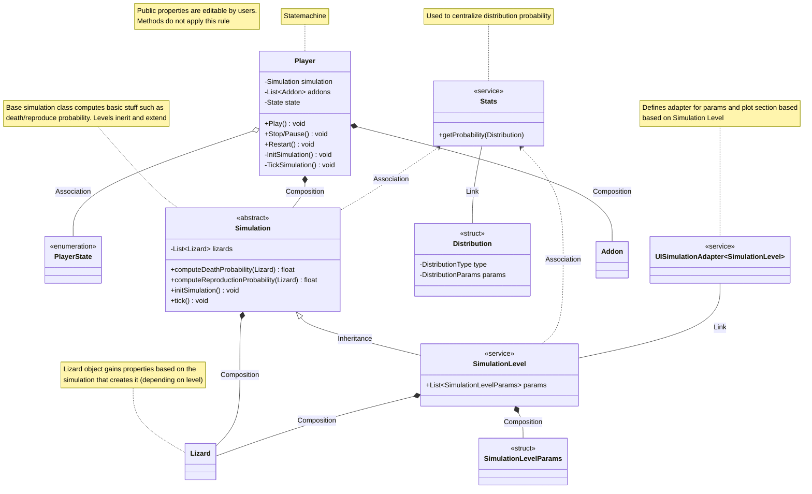

# React Simulator MVP Design Document

## Project Overview

### Project Name

Natural Selection Simulator

### Brief Description

Natural Selection Simulator is a project that helps illustrate certain concepts and forces behind natural selection using scaled versions of the example described in [10.1101/2022.03.13.484125](https://doi.org/10.1101/2022.03.13.484125). Using the lizard species *Uta stansburiana* as an object of study.

### Project Type

Interactive Frontend Web Application that runs on browser

---

## Goals & Objectives

### Primary Goal

Serve as a tool to bridge complex evolutionary concepts as a didactic, accessible, interactive and *fun* experience.

### Success Criteria

* Application is fun to use  
* Theoretical concepts are correctly represented and transmitted

---

## Target Audience

### Primary Users

Primarily, undergraduate students taking a transversal biology class

---

## Core Features & Functionality

### Must-Have Features (MVP)

#### Visuals

1. Organisms Display  
   * Organism and space representation of the natural selection simulation model we run. Each organism will have a clear visual representation that distinct them from others. Display must be a 2 dimensional space, where each dot will represent said organism in simulation in corresponding color  
   * As a \[user\] I want to be able to qualitatively see the effects of the current simulation being ran, letting me understand how the current parameters affect current simulation run  
2. Timeline and general controls  
   * Generation timeline representing the pass of time and change from time to  *t \+ 1*. General controls of simulation include:  
     * Pre simulation start controls (locked after start):  
       * Start simulation  
     * General:  
       * Play and pause simulation  
       * Restart button  
   * As a \[user\] I want to have a clear indication of how time passes during current simulation. Being able to distinguish when and at which moment we are representing a different point in time, as well as have control of simulation  
3. Population plot  
   * Plot describing current population on y axis and current point in time in x axis  
   * As a \[user\] I want to be able to have a quantitative way of analyzing population change across points in time  
4. Key metric over time plot  
   * Similar to population plots, plots describing simulation level defined key metrics (consider plotting different metrics in the same figure)  
   * As a \[user\] I want to be able to have a quantitative way of analyzing change in key metrics over time  
5. Parameter Sliders and controls  
   * Section where user-modifiable sliders controlling current simulation are present. Parameters can be edited live to be able to see effect of parameter changes in both organism display and respective plots. Parameters are defined per level of simulation/experiment. All experiments must have this parameters:  
     * Initial population (bounded by a hard-locked maximum) locked after start of simulation, defaults to hardcoded value if left empty, bounded  
     * N. generations limit (can’t be less than current),  defaults to hardcoded value if left empty, bounded  
     * Generation time pass rate (controls velocity of simulation), defaults to hardcoded value if left empty, bounded  
     * Add on experiments checkbox  
     * Level experiment defined select box (choose only one)  
   * As a \[user\] I want to be able to modify parameters in simulation to be able to observe through the rest of visual elements its modification impact  
6. *Live* simulation  
   * As stated before, parameters must be able to be edited live and be able to see effects in real time  
   * As a \[user\] I want to be able to modify simulation parameters and see the effect of modifications live in the visual elements

#### Simulation Modelling

For simulation modelling, each of the levels will define key metrics to track over time and analyze in simulation/experiment.

In general, for modelling we should define a general relation ***Y**(**X**)* where ***Y*** are the key metrics, and ***X*** related parameters.

Levels that define its own type of experiment cannot run at the same time. Only one type of experiment defined by a level can run at a time. Levels that define addons, define how they integrate into other levels that define its own type of experiment. Often as a parameter during interactions.

Each simulation has the following phases:

1. Start  
   * Roll initial state using current parameter state and initial population params  
2. Simulation play  
   * User can observe simulation and interact with parameters  
     1. Roll next state based on current state (generations passing)  
3. End  
   * User stops / pauses simulation or number of generations has reached limit

##### Level 1: Simple, single trait, directional selection

*Defines its own type of experiment*

Body size of the orange lizard:

* Bigger: slightly better chance at surviving  
* Smaller: slightly worse survival

Bigger lizards survive more, reproduce and this increases the trait each generation. Over time, body size will increase in population and variation will shrink

| *Key Metrics* | *Parameters* |
| :---- | :---- |
| \\text{total population} \= sum(\\text{current population}\_{t\_i}) \\text{average body size}\_{t\_i} \= \\frac{\\sum\_{n\_{t\_i}} \\text{body size}(n)}{\\text{total population}} | \\text{body size} \\sim \\mathcal{D\_{bz}} \\text{probability of death} \\sim \\mathcal{D\_{pd}} \\text{probability of reproduction}(\\text{body\_size}) \\sim \\mathcal{D\_{pr}} where \\mathcal{D} \\in {\\text{normal}, \\text{exponential}} Distributions are user editable (selectable) as well as their parameters  Probability of death threshold based on \\mathcal{D\_{pd}} as a slider \\text{dies next generation} \= \\text{probability of death} \>= \\text{death threshold}  |

###### *Notes:*

- Consider in design the possibility of adding more distributions and suggested values for user controlled parameters. Implement what's stated above for now

###### *Key Learning Takeaway:*

*If the environment rewards one trait consistently, evolution looks simple.*

##### Level 2: Multiple traits, rock-paper-scissors, negative frequency-dependent selection

*Defines its own type of experiment*

Three colors of lizards, each color has a strength and a weakness:

* **Orange:** Aggressive, dominant, controls several females  
* **Yellow:** Sneaky, mimics females, steals matings  
* **Blue:** Cooperative, guards just one female

The more aggressive orange males beat the less intrusive blue males, the territorial blue individuals usually fend off the territory-less yellows, while the opportunistic yellows mate with the females monopolized by the orange males ([10.1101/2022.03.13.484125](https://doi.org/10.1101/2022.03.13.484125))

* Orange beats Blue   
  * Oranges have several females, and have more chances of reproduction.   
* Blue beats Yellow  
  * Blue has one female, and has stable / constant reproduction probability. Can’t reproduce with females close to orange lizards  
* Yellow beats Orange  
  * Has low base reproduction probability. Probability is added an effect based on how much females nearby orange lizards have  
* Simulation must ensure:  
  * When Orange becomes common → Yellow does better  
  * When Yellow becomes common → Blue does better  
  * When Blue becomes common → Orange does better  
* Females mate randomly (no preference) so reproductive success \= strategy success  
  * Introduces a key component in this simulation. Females won’t be explicitly modelled. Probability of reproduction

| *Key Metrics* | *Parameters* |
| :---- | :---- |
| c \\in \\{ \\text{yellow}, \\text{orange}, \\text{blue} \\} \\text{total population}\_c \= sum(\\text{current population}\_{ct\_i}) | \\text{body size} \\sim \\mathcal{D\_{bz}} \\text{probability of death} \\sim \\mathcal{D\_{pd}} \\text{probability of reproduction}(C\_n, \\text{environment}) \\sim \\mathcal{D\_{pr}} Where C\_n is a normalized vector of weights per color describing the traits for lizard n corresponding to each color On each lizard birth, roll probability of new lizard of sharing traits of other colors. Eg. yellow lizard births a 98% yellow lizard and 1% blue 1% orange lizard, with each trait percentage distributing with a specific distribution. Prepare for this, and also discrete case where yellow lizard will always birth 100% yellow lizard individuals.  Env is a neighborhood of radius r. This is useful for determining reproduction for yellow and blue lizard advantages and disadvantages. Define thresholds for these advantages / disadvantages such as. Blue cannot reproduce when at least 1 orange lizard is in the neighborhood of radius r. where \\mathcal{D\_x} \\in \\{\\text{normal}, \\text{exponential}\\} Distributions are user editable (selectable) as well as their parameters  Probability of death threshold based on \\mathcal{D\_{pd}} as a slider  |

###### *Notes:* 

- Consider defining parameters in accordions for better UX

###### *Key Learning Takeaway:*

*The population cycles, because “fitness” depends on who is present and no trait is always best.*  
This means we should be able to see this behavior in the population plots, oscillation between populations. This is the main challenge of modelling this level

##### Level 3: Sexual selection

*Add on parameter*

Female choice of the rarest color. Rare colors get a frequency-based advantage independent of strength (a mating bonus)

| *Key Metrics* | *Parameters* |
| :---- | :---- |
| c \\in \\{ \\text{yellow}, \\text{orange}, \\text{blue} \\} \\text{enabled reproduction successes}\_c \= \\text{number of reproduction successes that would not have happened without this factor} as a bar plot, cumulative, not over time | \\text{added probability of reproduction}\_c(\\text{inverse frequency}\_c) \\sim \\mathcal{D\_{par}} Distributions are user editable (selectable)  Probability of death threshold based on \\mathcal{D\_{pd}} as a slider  |

###### *Key Learning Takeaway:*

*Suddenly, the fitness is not the strongest or more aggressive, but the least common.*

* Even “worst” strategies persist  
* Diversity is actively maintained  
* No stable winner: traits rise and fall over time  
* This adds variability to Level 2 stability, possibly breaking stability on some simulations runs

---

## Technical Requirements

### Technology Stack

#### Frontend

* Node package manager: bun  
* Framework: Vite React App  
* Language: Typescript / React  
* Tailwind css / shadcn/ui  
* Have two modes:  
  * Prepare for using organism display visualization using three.js. For now, only a plane with no orbiting.   
  * 2D plane  
* For plots and charts: Recharts

#### Infrastructure & DevOps

* Hosting: static github pages for now

---

## Architecture

### System Architecture

#### Notes

* Take off from proposed architecture diagram specified above

---

## User Interface & Experience

### Design Style

* Theme: minimal (use shadcn/ui)  
* Color scheme: dark theme using white, orange, blue, yellow (create tailwind palette to use)  
* Layout: Desktop first

### Key User Flows

1. User setting up parameters  
2. User seeing and analyzing plots  
3. User using simulation and timeline controls  
   1. Start simulation  
   2. Restart simulation  
   3. Pause simulation / Stop simulation

### Wireframes/Mockups

General layout:

* Two rows  
  * First row will span for about 70% of screen  
    * Will have two columns, 60% of it will be the organism display, rest will be plots  
  * Second row  
    * Will have two columns as well, same width. First container will be timeline and controls  
    * The rest will be the params accordions and sliders

---

## Testing Requirements

### Testing Strategy

* Unit test services defined in architecture  
* Unit test simple frontend conditions

---

## Development Workflow

### Development Phases

1. Phase 1: Basic service and UI layout initialization  
2. Phase 2: Level 1 simulation modelling  
3. Phase 3: Level 2 simulation modelling

### Versioning Strategy

Each of the development phases go in order, and represent branches merging to a parent feature branch. The parent branch name is mvp, the rest are created according to the phase name. Subdivide commits in each branch according to the implementation plan you'll develop as mentioned in the Next Steps section.  
---

## Documentation Requirements

### Required Documentation

* README with setup instruction  
* Architecture diagrams

---

## Open Questions

1. In general, how do we ensure the population won't die out? How do we parametrize the probability of death distribution so that we don't overflow or die out quickly  
2. General review on modelling and architecture, service naming etc.  
3. As mentioned, prepare to implement organism display using three.js. Consider we’ll use actual lizard models in future iterations of the project. For this moment, just use dots in a plane as mentioned

---

# Next Steps

1. Create a agent.md file in root that contain this rules and others to add in the future  
   1. App implementation must be rooted in packages/node directory  
   2. All documentation and intermediate plans/artifacts for code creation go in directory docs/artifacts  
   3. When referencing docs/artifacts you need to clarify which of the docs/artifacts/subdir you’ll read and write to. This way you won’t mix up implementation details on other development phases and/or iterations  
2. All artifacts for this current development will be written and read from docs/artifacts/mvp  
3. General review of this design document, on architecture and modelling. This document cannot be modified  
4. Discuss proposals, generate a .md document in artifacts directory as described before that contain conclusions on what is going to be added  
5. Create plans to divide and conquer implementation on each of the development phases described before.This is your guide to be able to persist context throughout the whole implementation of this whole project. Create these as well in corresponding artifacts directory  
6. Estimate the whole engineering/dev time needed to build this (without AI).  
7. Wait for my review and discussion and when I validate, build phase by phase using plans created in last step

---

# Metrics on Development

| Development Phase | Approximate Hours Spent |
| :---- | :---- |
| Design Doc / Implementation Prompt ||
| Design Doc Review |  |
| Code Review Implementation |  |
| Fixtures |  |
| Testing |  |
| Validation / Early Access |  |
| Release |  |
